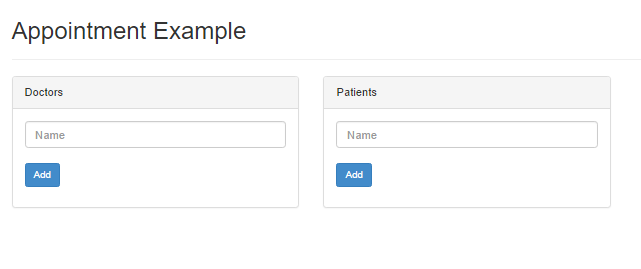

## The Appointment Scheduling Application

This is simple application that demonstrates

* A simple data model that illustrates relationships between objects
* Data binding from the model to the HTML view
* How to call code on the server

## How to set it up

* Clone or checkout this project from github

        https://github.com/selsamman/amorphic-drpatient-demo.git
    
* Make sure you have nodejs installed (version 4 or later)
    
* Run NPM to get the required node modules

        npm update
        
* Start the application

        node app.js --port 30001

* Go to the local web page in your browser

        http://localhost:30001
    
* And you should see    

    
  
## Put it through it's paces

* Enter the name of a doctor and hit enter

* Enter the name of a second doctor and hit enter

* Enter the name of a patient and hit enter

* Enter the name of a second patient and hit enter

* Click on one of the doctors to select it

* Select the patient in the drop-down on the right

* Enter a date (dd/mm/yy) and hit enter

* You will now see an appointment in the list on the right

* Refresh the browser window (or close it and reopen the same URL).  You will see that all your data was saved.

## Under the Covers

### The View

Let's first have a look at **apps/drpatient/public/index.html**.  It contains:

* Standard scripts needed. Underscore and Q are needed by the Amorphic software.  Bootstrap is optional but is used in this simple demo.

        <!-- standard software scripts --->
        
        
        
        
        <link href="../../common/css/bootstrap.min.css" rel="stylesheet">

    
* Amorphic software, including the data binding layer - Bindster, the type system - supertype, the browser server synchronization layer and the amorphic client
    
        <!-- amorphic static scripts -->
        
        
        
        
    
* The dynamically generated script which will set everything up, make sure things pick up where they left off if needed
    
    <!-- Dynamically generated script that will instatiate the controller -->
    

* Then you have the body of the HTML which we will com back to

* And finally a script that gets the application started

        <!-- Bind view to amorphic -->
        

So let's follow the trail .....

### Data Binding

* When you entered the name of the doctor this HTML was executedd

        <input b:bind="doctorName" class="form-control" placeholder="Name" b:onenter="addDoctor()"/>

    Notice the b: attributes on the input form.  The data binding layer, Bindster has a b: namespace for attributes that it knows about.  Notably:
    
        b:bind="doctorName" 
    
     Binds the input field to a property in the controller object called doctorName.  When you type into the field and lose focus, that property will be set to the value in the form field and conversely if the doctorName property is updated by Javascript, the form field will be populated.  Here try it by going to the Javascript console in the browser and typing
       
            > controller.doctorName = 'Foo';
            > controller.refresh()
        
     Now you will see Foo as the doctor name.  Type 'Bar' in the doctorName field and hit tab.  Then type this in the browser console:
            
            > controller.doctorName
              "Bar"
        
     You have just witnessed two-way data binding

### The Controller   

The input field also has an event declared

        b:onenter="addDoctor()" 
    
This causes the addDoctor() method in the controller to be executed in the controller which is contained in  **apps/drpatient/public/js/controller.js**. 
     
        module.exports.controller = function (objectTemplate, uses)
        {
            var BaseController = uses('./baseController.js', "BaseController");
            var Doctor = uses("model.js", "Doctor");
            var Patient = uses("model.js", "Patient");
            var Appointment = uses("model.js", "Appointment");
            Controller = BaseController.extend("Controller", {
                ....
            }
            
        }    

All amorphic application files are organized into templates.  Templates are defined in files that export an initialization function that Amorphic wil call to craete the templates. The property exported (controller in this case) **must be named the same as the file itself**.  Two parameters are passed in the intialization function:

* **objectTemplate** used to create new templates (we will se that in action later)
    
* **uses** a function to declare usage of other templates.  **uses** is passed the file name of the template and the template name itself
    
    
Within this initialization function we declare our usage of a stock base controller (**BaseController**) and the various templates that we need for our "model" (**Doctor**, **.  Finally we create our **Controller** template by extending the base controller.  This gives our controller all of the properties and methods of the base controller and let's us add our own properties and methods.  A few of these we just excercised in our demo:
    
   doctorName:     {type: String},
     
Defines the doctorName property as bein a **String** type
     
    doctors:        {type: Array, of: Doctor, value: []},
      
Defines an **Array** of **Doctor** objects as defined in the **Doctor** template.  Importantly we initialized the value to that of an empty array **[]**

### Controller Events     
     
Within the controller there is the code that was executed from the **b:onenter**  
     
    addDoctor:  {on: "server", body: function () {
         var doctor = new Doctor(this.doctorName)
         this.doctors.push(doctor)
         this.doctorName = "";
     }},

 The **addDoctor** is defined to be a function that lives on the **server**.  This means that when you hit enter the following sequence of events happened:
     
* All of the data in the browser (notably the value in the doctorName field you just updated is synchronized with the server

* Your addDoctor function is execute on the server.  It creates a new Doctor object and and adds it to the doctors array.

* All of the changes to data on the server (notably the new element in the doctors array and the clearing of the doctorName field) is now synchronized with the browser as you return from the addDoctorFunction

* Amorphic automatically renders the screen (like when you typed controller.refresh()) and the new doctor name appears in the list above the input field
     
That is a lot to happen from this one little function definition but this is the essence of what Amorphic does for you - it let's you execute code on the server within the same file that contains code executed in the browser.  It keeps everything in sync to allow this all to happen in a seamless fashion.  Note that in this case we didn't have to declare our function as living on the server.  It could just as well have been on the browser.  However - if we did not make a call to the server, the data would never have been saved on the server and when we hit refresh it would have cleared everything.  

### The Model    
    
Let's have a look at the templates for the principal entitie, Doctor, Patient and Appointment whih constitute the model:
    
    module.exports.model = function (objectTemplate, uses)
    {
        var Doctor = uses("model.js", "Doctor");
        var Patient = uses("model.js", "Patient");
        var Appointment = uses("model.js", "Appointment");
    
        objectTemplate.create("Doctor", {
            name:           {type: String},
            appointments:   {type: Array, of: Appointment, value: []},
            init: function (name) {this.name = name}
        });
    
        objectTemplate.create("Patient", {
            name:           {type: String},
            appointments:   {type: Array, of: Appointment, value: []},
            init: function (name) {this.name = name}
        });
    
        objectTemplate.create("Appointment", {
            doctor:         {type: Doctor},
            patient:        {type: Patient},
            when:           {type: Date},
            init: function(when, doctor, patient) {
                this.when = when;
                this.doctor = doctor;
                this.patient = patient;
                doctor.appointments.push(this)
                patient.appointments.push(this);
            }
        });
    }

As usual the template file starts with the intializer function, this time exporting model which corresponds to the name of the model file, model.js.  It declares it's usage of the three entities.  By declaring them at the top of the file, these templates were immediately available for use.  This way in the Patient template when a reference is made to the Appointment template
    
    appointments:   {type: Array, of: Appointment, value: []},

The Appointment template has already been declared.  Otherwise it would be unresolved.    So we see here how the objectTemplate parameter is used.  It is used when you want to create a brand new template.  We also see that the templates bascially define a standard Javascript function that can be used to create an object using the **new** operator as we saw in the addDoctor function:
 
     var doctor = new Doctor(this.doctorName)
  
Amorphic uses this form of "classical inheritence" rather than prototypal inheritance (the createObject pattern).  

### Relationships between Objects

Also note the **init** function in the tmeplate definitions.  When you execute the **new** operator on a template the **init** function is executed and you can put any code needed to setup the property values there.  Let's look at the **init** function for appointment:
  
     init: function(when, doctor, patient) {
          this.when = when;
          this.doctor = doctor;
          this.patient = patient;
          doctor.appointments.push(this)
          patient.appointments.push(this);
      }
                  
This **init** function takes three parameters which are all needed to seup an new appointment.  **when** is a time which is just assigned to the when property but **doctor** and **patient** are objects that are assigned to their respective properties.  Note that to setup the appointment, the new appointment is pushed into the appointment arrays of both the doctor and the patient.  Here is the code in the controller that is executed when you added the appointment:
   
       addAppointment:  {on: "server", body: function () {
           (new Appointment(this.appTime, this.appDoctor, this.appPatient));
           this.appTime = null;
       }}

This code (which lives on the server), simply creates a new **Appointment** object.  It doesn't need to do anything with it once it is created since the **init** function, as we just saw, added the appointement to both the **Doctor** and the **Patient**.  But how did we get **this.appDoctor** and **this.appPatient**?  Of course they are properties of the controller
  
      // New appointment properties
      appDoctor:      {type: Doctor},
      appPatient:     {type: Patient},
      appTime:        {type: Date},

But how did their values get populated?
    
* **appTime** is simply bound using a **formatter** and **parser** defined in the baseController that deal with dates and times.  Formatters are methods in the controller that are called to format data before transferring it to the form control and parsers are methods in the controller that process data from the control before it is moved to the data property.
  
      <input b:bind="appTime" class="form-control" b:onenter="addAppointment()"
             placeholder="Appointment Time" b:format="formatDateTime()" b:parse="parseDate()"/>

* **appDoctor** represents the currently selected doctor (the one you click on in the list).  Here is the HTML that generates the list of doctors and selects the current one 
    
        <b:iterate on="doctors" with="doctor">
                

        </b:iterate>
 
    The **\<b:iterate\>** tag will cause the enclosed code to be generated a number times based on the **on** attribute which in this case refers to the array of doctors.  On each iteration the **with** property causes a property to be created in the controller that is populated with the value of the specific instance of the doctor array for that iteration.  What that means is that when the **b:onclick** code is executed **doctor** set set to that specific instance before executing the code so in this case it will set the **appdoctor** property in the controller to the currently selected **doctor**
     
* **appPatient** is selected using a drop-down
     
        <select b:bind="appPatient" class="form-control" b:fill="patients"
                 b:fill-key="value._\\_id_\\_" b:fill-value="value.name"></select>
     
     The data binding layer has special handling for selects:
     
   * It will "fill" the values based on the **b:fill** attribute.  In this cases it points to the array of patients in the controller.
   * Since this is an array of objects you need to specify the particular property of that object which will be used as the select option keys  (value attribute of the option tag).  This is done with the **b:fill-key** attribute which in this case is set to the **__id__**.  The **\\** characters are used to escape handling of the **__xxx__** pattern which would otheriwse have special meaning.  Every object has a property **__id__** which uniquely identifies it so the list of options will have unique values.
    * Similarly you also need to specify the text of the option tag with the **fill-value** attribute.  In this case it is the **name** property of the patient object.
    * Normally when you select a value the data binding layer will simply populate the bound field (in this case **appPatient** with the selected key (value attribute of the option tag).  However when the value is **__id__** the data binding layer wills substitute the actual object.  So selecting the patient in the drop-down actually populates **appDoctor** with the object that represents that doctor.
    
## Making the App Persistent
    
There are a hand full of things we need to do to make the application save to and retrieve from a database.  In this tutorial we will use MongoDB first and then convert to Postgres.  The only difference will be the starting parameters.  For Mongo you would use this:
   
    node app.js --port 3001 --dbname drpatient --dbpath mongodb://localhost:27017/
    
This assumes Mongo is installed locally on the standard port 27017 and requires not authentication.  The database name would be **drPatient**.  To use Postgres you would use this to start the application:
    
    --port 3001 --dbdriver knex --dbtype pg --dbpath 127.0.0.1 --dbname drpatient  --dbuser nodejs --dbpassword nodejs
    
This assumes that you:
  * Install Postgres locally on the default port
  * Create a database called drpatient
  * Assign the database a user name of **nodejs** and a password of **nodejs**
  * Create the tables and columns (see the sections that follow for how to do that automatically)
   
### The Schema
   
To persist your objects you must create a schema that tells Amorphic where the objects are to be stored and how they are to be linked together.  This is contained in schema.json and the demo already comes with a schema to make it easier to get started with persisting.  The schema looks like this:
    
    {
      "Doctor": {
        "documentOf" : "Doctor",
        "children": {
          "appointments":    	{"id":"doctor_id"}
        }
      },
      "Patient": {
        "documentOf" : "Patient",
        "children": {
          "appointments":       {"id":"patient_id"}
        }
      },
      "Appointment": {
        "documentOf" : "Appointment",
        "parents": {
          "doctor":      		{"id": "doctor_id"},
          "patient":      	{"id": "patient_id"}
        }
      }
    }
 The important parts are:
 * The top level declarations for each Template, **Doctor**, **Patient** and **Appointment**
 * The definition of a document name for MongoDB.  There is also a **tableName** for Postgres, but **documentOf** will be used if no **tableName** is specified allowing the schema to do double-duty.
 * The **children** declaration which is needed when you have an array of templates.  Each property in **children** should correspond to the property name in the template having an array of templates.  For each reference you need an **id** property which names an extra column in the child table that will be added to maintain the relationship.
 * The **parents** declaration which is needed when you have references (non-array) to templates.  For each property you reference you need an **id** property which names the extra column in the table used to maintain the linkage.

### Saving objects
    
In each of the methods in the controller you need to add persist call to the object being created:
    
        addPatient: {on: "server", body: function () {
                var patient = new Patient(this.patientName);
                this.patients.push(patient);
                this.patientName = "";
                patient.persist();
            }},
    
            addDoctor:  {on: "server", body: function () {
                var doctor = new Doctor(this.doctorName)
                this.doctors.push(doctor)
                this.doctorName = "";
                doctor.persist();
            }},
    
            addAppointment:  {on: "server", body: function () {
                var appointment = (new Appointment(this.appTime, this.appDoctor, this.appPatient));
                this.appTime = null;
                appointment.persist();
            }},

You also need to read the list of patients and doctors from the database.  There are several ways to do that.  They most "dynamic" way to do this is request them when the page renders.  To do this replace the reference to the arrays of doctors and patients with doctorsGet() and patientsGet() respectively:
           
     <b:iterate on="doctorsGet()" with="doctor">
        

     </b:iterate>

and 

     <b:iterate on="patientsGet()" with="patient">
        

     </b:iterate>

Amorphic has mechanism that used within the model (not the controller) where it will automatically generate an xxxGet method for every property that references another template.  It also generates the appropriate server methods xxxFetch that xxxGet will call which will retrieve the related objects.  This let's lazily load related objects as the HTML needs them.  Behind the scenes this is what happens:
* When the data binding layer starts the iteration it calls xxxGet().  xxxGet() determines if the data has already been fetched.  There are three possible situations:
  * The data could have already been fetched and so the data is just returned
  * This could be the first reference to the data and so the xxxFetch() method is called on the server to retrieve the data.  In the mean time an empty array is returned so nothing is iterated on (empty list)
  * The data is not available yet but he xxxFetch() method has already been called.  In that case also an empty array is called.
* Once xxxFetch is complete, Amorphic will re-render the HTML.  This time the data will be available when calling xxxGet and the iterate block will fill
* In order to manage the "state" of whether data has been fetched or is in the process of being fetched an extra property xxxPersistor is automatically added.  It contains two properties that xxxGet manages:
  * **isFetching** set to true once the xxxFetch has been called and is reset when the data is finally fetched
  * **isFetched** indicates that the data has been fetched.

This works fine between objects that are part of the model (e.g. where the referencing object is in the schema) but does not work automatically with Controllers and so you need add doctorsFetch and patientsFetch method yourself and also add the autoFetch: true to the doctors and patients array so the xxxGet functions will automatically be added:

        doctors:        {type: Array, of: Doctor, value: [], autoFetch: true},
        doctorsFetch:   {on: "server", body: function () {
            return Doctor.fetchByQuery({}).then(function (doctors) {
                this.doctors = doctors;
                this.doctorsPersistor={isFetched: true, isFetching: false};
                return doctors;
            }.bind(this));
        }},
 
 and
 
        patients:       {type: Array, of: Patient, value: [], autoFetch: true},
        patientsFetch:   {on: "server", body: function () {
            return Patient.fetchByQuery().then(function (patients) {
                this.patients = patients;
                this.patientsPeristor={isFetched: true, isFetching: false};
                return patients;
            }.bind(this));
        }},

Notice that the xxxFetch methods have to set the xxxPersistor property to indicate that the data has been fetched.