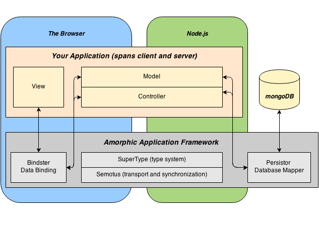

### Welcome to Amorphic

Amorphic is a full-stack, isomorphic framework for creating web-based applications with Node.js and MongoDb.

The goal of Amorphic is to let you focus on the logic of your application with minimal regard for:

* Where code executes - code executes in the browser or on the server with seamless calls between the two
* Dealing with a DB - objects and their relationships can be saved and retrieved automatically
* How the DOM works - two way data binding means no glue code

### How it works

You define objects that live on both in the browser and on the server as part of user's session with the server.  Your object methods are defined either as executing in the browser or on the server.  You may call methods on the server from within methods on the browser. When you do so all properties are synchronized and your call is executed on the server. The upshot is that you choose where to execute your code based criteria such as speed, proximity to persistent storage or security but the structure and coding style does not have to vary (except for access to server only resources).

To keep track of all this you need to define your objects using Amorphic's templating system which lets you define object, their properties and relationships to other objects.  As a bonus this definition also serves as the core a database schema that is lightly augmented with an external schema file to take care of data base dependent considerations like object to table mappings and foreign keys.  You can save and and retrieve objects and their relationships to any depth with a simple call with full ACID support if Postgres is chosen as the database.

Finally mapping your objects to the screen uses data-binding that is analogous to Angular except that it has tighter integration with your object definitions.  For example you can define values and descriptions for a multi-valued property as part of your object template, bind that to a select control and it will automatically populate the options.
### Model, View, Controller

Amorphic is built on a model, view, controller paradigm

* **Model** - Objects that represent your data and our typically persisted in a database.

* **View** - HTML mapped to properties in your model or controller using data binding and directives which effectively make the HTML a template.

* **Controller** - Acts as your session and is also the root scope for data mapping to the view. You may compose more granular controllers to keep things modular.

These Amorphic components support this structure:

* **Supertype** - is the type system that supports rich definitions of objects, properties and their relationships with support for classical inheritence.  The fact that Amorphic has detailed knowledge of your data is what allows it to synchronize between the browser and the server and persist your data.

* **Semotus** - Is the transport and synchronization mechanism between the browser and the server

* **Bindster** - Is the data binding and templating system that includes routing.

* **Persistor** - Is the Object Relational Mapper (or non-relational in the case of MongoDB) that persists your data and manages it's retrieval. 

### Session Oriented
 
 Each web browser session gets it's own session and it's own "object space".  There are no objects that are shared between sessions.  Amorphic manages sessions using Connect and it's session semantics.  This means that if you configure Redis as your session store you can load balance across multiple servers.  Amorphic is optimized for sticky sessions.  
  

